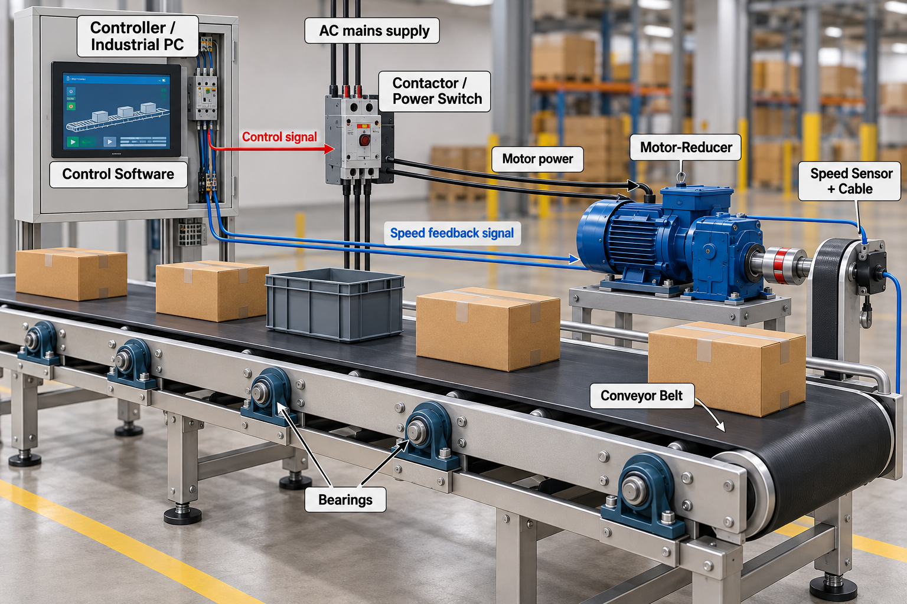

# Industrial Conveyor Reliability Data Challenge

Student Requirements and Data Guide

Students are provided with historical daily operating and reliability data for a fleet of industrial conveyor systems. The task is to understand what the data reveal about component reliability and to build a reusable forecasting tool that can operate on the current history of an unseen conveyor.

*Figure 1. Industrial conveyor system and modeled components.*

> **Provided material:**
>
> - one historical Parquet dataset covering the fleet: **`2026-09_compet_Student_Historical_Data_V03.parquet`**
> - two example input files extracted from conveyor P02CV27: **`Example_P02CV27_1Year.parquet`** and **`Example_P02CV27_6Years.parquet`**. These are cut-off versions of the same P02CV27 history already contained in the historical Parquet dataset: one ends after the first 1 year of observations and the other after the first 6 years.
> - this challenge document and
> - the system illustration.

## 1. System Description

The conveyors are indoor, fixed-speed flat-belt systems used to move unit loads such as boxes, crates, and packaged parts. Each conveyor operates as one integrated production asset: the electrical/control elements command the motor-reducer, the motor-reducer drives the belt, the speed sensor reports conveyor motion, and the belt is supported by a population of bearings.

The modeled reliability boundary includes seven component groups:

- Controller / Industrial PC;
- Control Software;
- Contactor / Power Switch;
- Motor-Reducer;
- Speed Sensor + Cable;
- Conveyor Belt; and
- the Bearings.

> **Note:** The roller structure itself is not treated as a separate failure component.

A recorded failure of any modeled component stops the conveyor. The historical data therefore combine component failures with the operating, environmental, electrical, production, and maintenance conditions observed for the conveyor on each calendar day.

## 2. What the dataset represents

**One row represents one calendar day for one conveyor.** Each conveyor therefore appears on many consecutive rows. Some columns describe fixed conveyor or plant characteristics and intentionally repeat every day; other columns describe the operating conditions, use, maintenance state, and failures observed on that particular day.

**Daily state.** `Daily_State` is the primary indicator of what happened to the conveyor on that calendar day.

- `RUNNING` means normal operation;
- `FAILURE_DAY` means a failure occurred during the day and, by dataset convention, the conveyor is treated as having operated for at most half of what it would have operated without a failure;
- `CORRECTIVE_DOWNTIME` means the conveyor is stopped for repair after a failure; and
- `PLANNED_MAINTENANCE` means it is intentionally stopped for scheduled maintenance.

The last two states (corrective and preventive maintenance) have zero operating hours. Failure and maintenance status should therefore be interpreted from `Daily_State` together with `Failure_Type` and the operating/downtime fields.

**Missing values.** Blank/NULL values are normal when a field is not applicable. For example, `Failure_Type` is blank on a day without a failure, and throughput-related values may be blank when the conveyor did not operate.

**Important:** The dataset is historical evidence.

## 3. Parquet data structure

The student-facing Parquet file contains the columns listed below. The names shown are the exact column names to be interpreted by your analysis and forecasting workflow.

### Identification and fixed system characteristics

| Column | Meaning |
| --- | --- |
| `Date` | Calendar date represented by the row. |
| `Plant_ID` | Plant identifier (for example P01, P02). |
| `Conveyor_ID` | Unique conveyor identifier (for example P02CV27). |
| `EIS_Date` | Entry-into-service date for the conveyor. |
| `Age_Calendar_Days` | Calendar age of the conveyor, in days, measured from `EIS_Date`. |
| `Length_m` | Physical conveyor length in metres. |
| `Bearing_Count` | Number of bearings associated with that conveyor. |
| `Load_Class` | Plant/conveyor operating class: Light, Medium, or Heavy. |
| `Rated_Throughput_kg_h` | Rated throughput capacity, in kilograms per hour. |
| `Belt_Speed_m_s` | Nominal belt speed in metres per second. |
| `Roller_Diameter_mm` | Roller diameter in millimetres. |

### Daily environment and electrical conditions

| Column | Meaning |
| --- | --- |
| `Temperature_Max_C` | Maximum plant temperature for the day, in degrees Celsius. |
| `Temperature_Min_C` | Minimum plant temperature for the day, in degrees Celsius. |
| `Humidity_pct` | Daily relative humidity, in percent. |
| `Voltage_V` | Observed daily supply voltage, in volts. |

### Daily operation and accumulated exposure

| Column | Meaning |
| --- | --- |
| `Daily_State` | Primary daily operating-status field. `RUNNING` = normal operation for the day. `FAILURE_DAY` = a failure occurred during the day; by dataset convention the conveyor is credited with one-half day of operation (12 operating hours) and 12 hours of downtime. `CORRECTIVE_DOWNTIME` = the conveyor is unavailable for corrective repair after a failure (0 operating hours, 24 downtime hours). `PLANNED_MAINTENANCE` = scheduled maintenance shutdown (0 operating hours, 24 downtime hours). These states replace separate failure/maintenance indicator columns. |
| `Operating_Hours_Day` | Number of operating hours recorded during that day. |
| `Cumulative_Operating_Hours` | Total operating hours accumulated by the conveyor up to that day. |
| `Operating_Hours_Since_Restart` | Operating hours accumulated since the most recent restart. |
| `Start_Stop_Cycles_Day` | Number of start/stop cycles recorded during that day. |
| `Cumulative_Start_Stop_Cycles` | Total start/stop cycles accumulated up to that day. |
| `Throughput_kg_per_h` | Average material-flow rate while the conveyor is operating on that day, in kilograms per operating hour. This is a rate, not the total mass moved during the day. Use it together with `Operating_Hours_Day`: `Total_kg_Day = Throughput_kg_per_h × Operating_Hours_Day`. Therefore a `FAILURE_DAY` with 12 operating hours transports approximately half the mass that the same hourly throughput would produce over a full 24-hour operating day. The value is blank when the conveyor has zero operating hours. |
| `Total_kg_Day` | Total mass transported during the day, in kilograms. |
| `Cumulative_kg` | Total mass transported by the conveyor since entry into service. |
| `Estimated_Roller_Revolutions_Day` | Estimated number of roller revolutions during the day, based on operating time and conveyor geometry. |

### Daily condition-monitoring measurements

The dataset also contains daily condition-monitoring measurements. These are physical or virtual measurements that may change with both operating conditions and equipment condition; they are not direct health scores or remaining-useful-life labels. Values may be blank when the measurement is not applicable or cannot be obtained because the conveyor is not operating.

| Column | Meaning |
| --- | --- |
| `Motor_Current_A` | Representative motor current, in amperes, while the conveyor is operating. It reflects the electrical load seen by the motor and can also change as the motor-reducer ages. A higher value is therefore not, by itself, proof of degradation; material throughput and operating conditions must also be considered. |
| `Motor_Temperature_C` | Representative measured motor temperature, in degrees Celsius, while operating. The value is influenced by ambient temperature, motor loading/current, and motor-reducer condition. It is a condition-monitoring signal rather than a direct remaining-life indicator. |
| `Structure_Vibration_RMS_mm_s` | Idealized aggregate RMS vibration level, in mm/s, obtained conceptually from a distributed set of vibration sensors mounted along the conveyor structure. The signal can reflect vibration generated by the motor-reducer, bearings, belt, and operating load. In a real installation, vibration from different sources would not reach all sensor locations with the same amplitude or influence; structural dynamics, sensor position, mounting, and frequency response would affect each measurement. The dataset intentionally provides one simplified aggregate structural-vibration indicator. |
| `Contact_Voltage_Drop_mV` | Measured voltage drop, in millivolts, across the closed contactor/power-switch contacts while current is flowing. It can increase as the contacts deteriorate, but it is also affected by the current being carried; it must therefore be interpreted together with operating load and motor current. |
| `Contactor_Closing_Time_ms` | Virtual condition measurement calculated by the controller/PC, in milliseconds. It represents the elapsed time between sending the contactor close command and detecting the first mechanical vibration/start response of the conveyor. It is not a dedicated physical timer sensor; it is derived from command timing and the observed mechanical response. |

### Failures and maintenance

| Column | Meaning |
| --- | --- |
| `Failure_Type` | Recorded failed component on a `FAILURE_DAY`. Typical values correspond to the modeled components, including `Controller_PC`, `Control_Software`, `Contactor`, `Motor_Reducer`, `Speed_Sensor`, `Conveyor_Belt`, and `Bearing`. Blank for non-failure daily states. |
| `Failed_Component_ID` | Specific failed component identifier when applicable; for example a bearing identifier such as `BRG_001`. Blank when no specific subcomponent ID is needed. |
| `Sensor_Replacement` | 1 if a speed sensor replacement was recorded on that day; 0 otherwise. |
| `Downtime_Hours_Day` | Total non-operating hours during the day. Under the dataset convention, `RUNNING` normally has 0 downtime hours, `FAILURE_DAY` has 12 downtime hours, and `CORRECTIVE_DOWNTIME` or `PLANNED_MAINTENANCE` has 24 downtime hours. |
| `Days_Since_Last_Failure` | Number of calendar days since the most recent recorded failure; blank before the first failure. |
| `Cumulative_Failure_Count` | Total number of recorded failures for the conveyor up to that day. |

## 4. Example input files: P02CV27

To make the required interface concrete, two example Parquet files are supplied. Both are extracted from conveyor P02CV27, which is already present in the main historical fleet dataset. They contain no new or duplicated experimental scenario: they are simply cut-off views of the same chronological P02CV27 record. The 1-year file contains the history from entry into service through the end of the first year; the 6-year file contains that same history continued through the end of the sixth year.

| Example file | History available | Purpose |
| --- | --- | --- |
| `Example_P02CV27_1Year.parquet` | First 1 year of P02CV27 history | Cut-off after year 1. Demonstrates the required tool behaviour when only a short current history is available. |
| `Example_P02CV27_6Years.parquet` | First 6 years of the same P02CV27 history | Cut-off after year 6. Demonstrates the same required tool behaviour when substantially more operating history is available. |

The two files are intentionally different lengths. Your solution must therefore not be designed around a fixed number of rows, a fixed number of years, or a hard-coded final date. The Parquet file should be treated as the current observed state/history of one conveyor: the tool must read all rows provided, identify the last observed day automatically, and generate the required forecasts from that point forward.

## 5. Challenge requirements

Your submission must address all three requirements below. The choice of reliability, statistical, machine-learning, or hybrid methods is yours. The same technical solution must be used for the example files and for the hidden evaluation file.

### Requirement 1 — Understand the reliability behaviour of the components

Using the provided historical fleet data, determine and explain everything you can infer about the reliability behaviour of each modeled component. Identify meaningful patterns, relationships, differences between components, operating effects, failure behaviour, and uncertainty that are supported by the data. The objective is to show what you understand from the evidence, not to reproduce a predefined model.

### Requirement 2 — Predict the next five failures

Your tool must accept the path to an input Parquet file and read it automatically. During evaluation, each input file will contain at least 250 calendar days of observed conveyor history, but it may contain substantially more. This is only a minimum-history guarantee: your solution must not assume a fixed number of rows, a fixed number of years, or a hard-coded final date. It must automatically use all history supplied in the file. From the available history, predict the next five failures. For each prediction, report the expected failure type/component and when the failure is expected to occur, expressed as an expected date and/or time from the last observed day.

### Requirement 3 — Forecast downtime over the next three years

Using the same input file and the same current conveyor state, provide a time-resolved forecast for the three years immediately following the last observed day. Estimate the expected downtime over that horizon and report the expected total downtime. Your output should make it possible to understand how the expected downtime evolves through the three-year forecast period.

## 6. Evaluation interface

During evaluation, the organizers will point your submitted Google Colab notebook to a Parquet file containing the observed history of a conveyor. Every evaluation file will contain at least 200 calendar days of history. The notebook must determine the available history automatically, run without changes to its analysis or model logic, and produce the outputs required by Requirements 2 and 3.

The hidden evaluation file follows the same student-facing column structure described in this document. The hidden future outcomes are retained by the organizers for evaluation and are not supplied to participants.

## 7. Submission and presentation format

The technical requirements above do not change. In addition, the following submission format is required so that the solution can be evaluated consistently and the main findings can be presented quickly.

| Deliverable | Requirement |
| --- | --- |
| **Google Colab notebook** | The analysis and forecasting tool must be delivered as a Google Colab notebook. It must implement the complete workflow used for Requirements 2 and 3 and accept the Parquet file as described above. The submitted Colab must remain unchanged for seven days after submission so that the organizers can reproduce the submitted result. |
| **Printed Colab record** | A printed copy of the complete submitted Google Colab must also be provided by email prior to the end of the competition, at the submission deadline. This printed copy serves as evidence of the exact version submitted and must correspond to the Colab that remains unchanged during the following week. |
| **Exactly two PowerPoint slides** | Submit exactly two PowerPoint slides summarizing your strongest conclusions from Requirement 1. There is no title or introduction slide: both slides must contain results/conclusions. The names of all participants must appear on each slide. The slides should communicate the most important findings directly and be suitable for a very short oral presentation to the conference participants. |
| **Oral presentation** | The two slides will be presented in a very limited time window (approximately three minutes). Prioritize the clearest, strongest, and most defensible findings; do not use the presentation time to explain code or implementation details unless they are essential to a conclusion. |

> **The organizers should be able to point the unchanged Colab to a Parquet file, use their model and provide the next-five-failure forecast and the three-year downtime forecast.**
