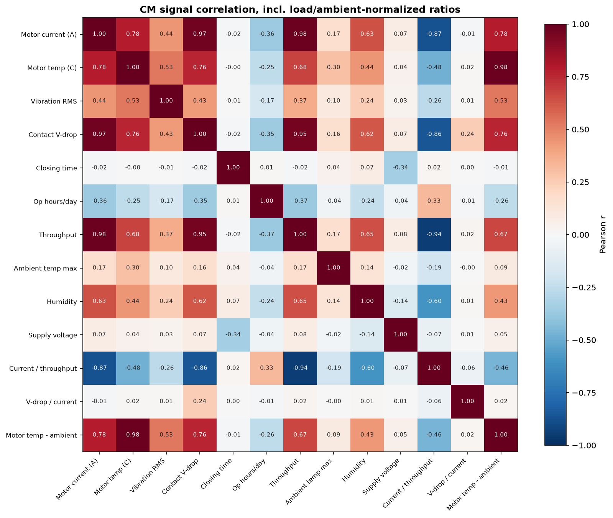
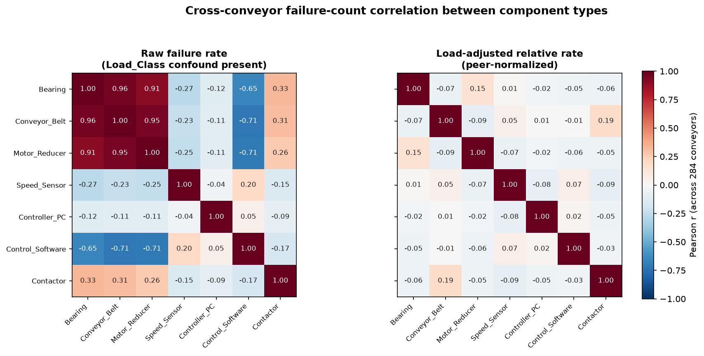
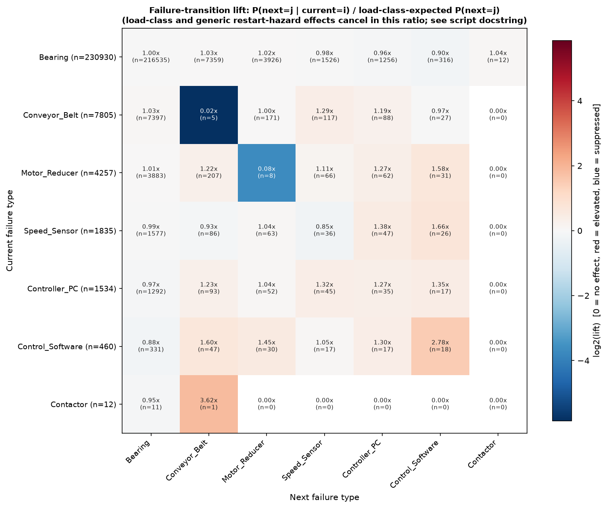
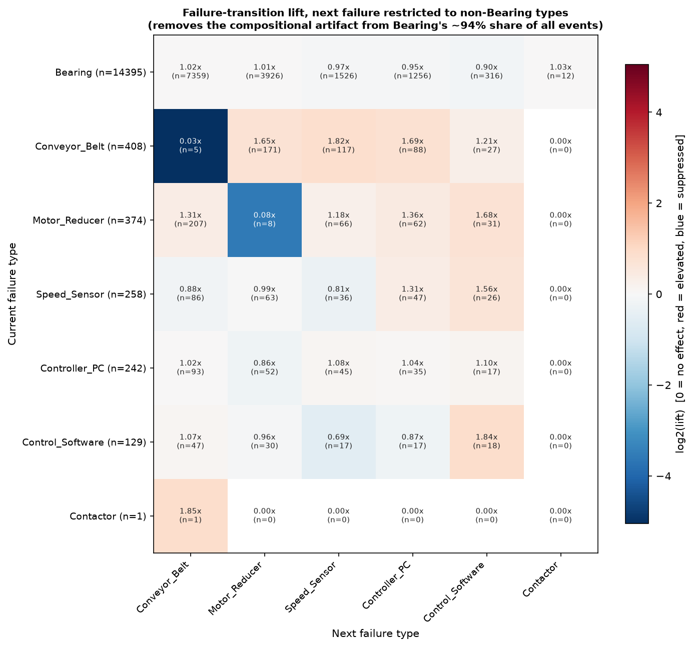
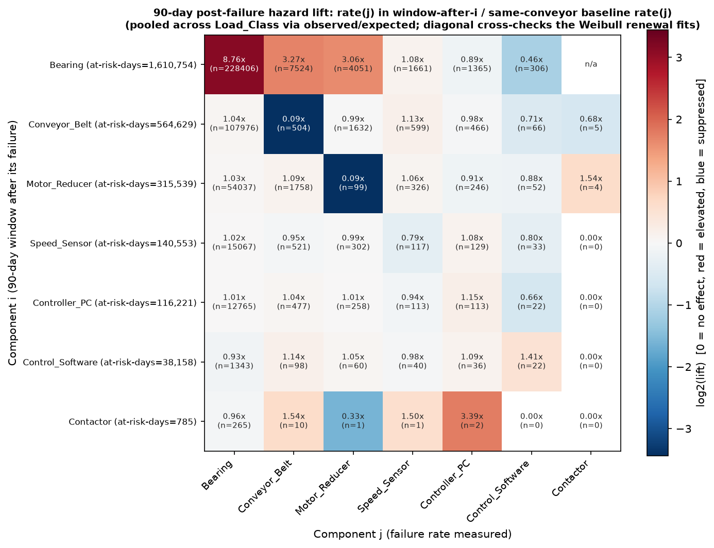
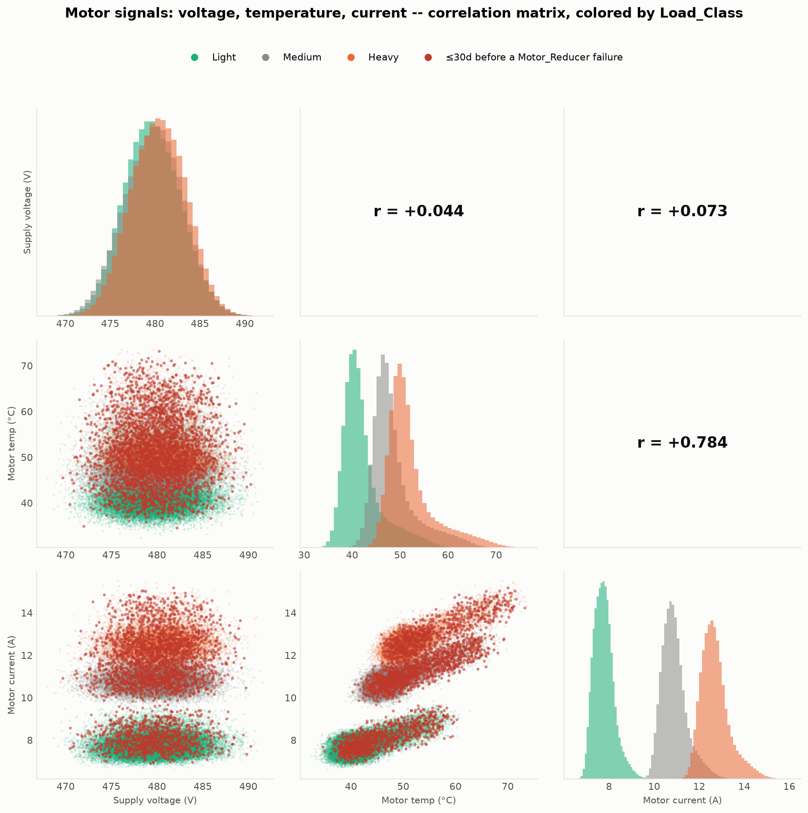
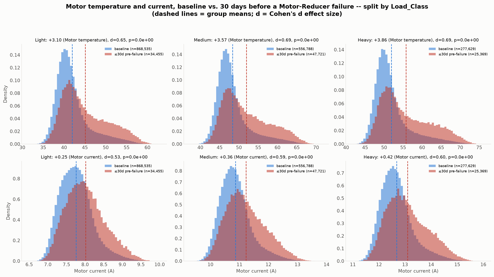

# Failure-Mode & Signal Correlations

**Source:** `2026-09_compet_Student_Historical_Data_V03.parquet`, queried with DuckDB.
**Generated:** 2026-09-26.
**Reproduce:**
```
uv run --no-project --with duckdb --with matplotlib --with pandas --with numpy \
  python analysis/failure_interactions/plot_cm_signal_correlation.py
uv run --no-project --with duckdb --with matplotlib --with pandas --with numpy \
  python analysis/failure_interactions/plot_cross_conveyor_failure_correlation.py
uv run --no-project --with duckdb --with matplotlib --with pandas --with numpy \
  python analysis/failure_interactions/plot_failure_transition_lift.py
uv run --no-project --with duckdb --with matplotlib --with pandas --with numpy \
  python analysis/failure_interactions/plot_failure_hazard_window.py
uv run --no-project --with duckdb --with matplotlib --with pandas --with numpy \
  python analysis/failure_interactions/plot_motor_signal_correlation.py
uv run --no-project --with duckdb --with matplotlib --with pandas --with numpy --with scipy \
  python analysis/failure_interactions/plot_motor_failure_precursor_by_load.py
```

## Overview

This topic asks two different questions that both get called "a correlation matrix":

1. How do the condition-monitoring/exposure/environment **signals** relate to each other?
2. Does a failure of one **component** change the odds or hazard of another component
   failing? Since `Daily_State`/`Failure_Type` records at most one failure per day (the
   conveyor is a series system — one failure stops it), failure-type columns are
   mutually exclusive by construction, so a same-day correlation between them is
   meaningless. Each analysis below reframes the question into something well-posed,
   and — critically — controls for the confounds that would otherwise fake a
   component-to-component effect: **`Load_Class`** (Heavy conveyors fail more at
   everything) and **age/wear-out trend** (bearings, belt and motor-reducer all have
   β > 1, so hazard rises with cumulative exposure regardless of what failed last).

## 1. Condition-monitoring signal correlation



- `Motor_Current_A`, `Contact_Voltage_Drop_mV`, and `Throughput_kg_per_h` are almost
  collinear (r = 0.95–0.98): the raw contactor voltage-drop signal is mostly just
  reading electrical load, not contactor wear, exactly as the spec's own caveat says.
  `Motor_Temperature_C` also tracks current/throughput strongly (r ≈ 0.68–0.78).
- Normalizing removes most of this: `Contact_Voltage_Drop_mV / Motor_Current_A`
  decorrelates almost completely from every raw driver (|r| ≤ 0.24, mostly < 0.06) —
  once you divide out the current it's carrying, it stops looking like a load proxy
  and becomes a much cleaner (if noisy) condition signal. `Motor_Temperature_C -
  Temperature_Max_C` stays highly correlated with `Motor_Temperature_C` itself
  (r = 0.98), so it mainly re-expresses the same information, not a new axis.
  `Motor_Current_A / Throughput_kg_per_h` sits in between (r up to −0.94 with raw
  throughput, since it's a ratio built from it, but only −0.19 with ambient
  temperature). This is consistent with the CM-precursor ratios already used in
  `scripts/02_reliability_analysis.py` §E — this matrix is the general-case
  confirmation that those specific normalizations were the right ones to decorrelate
  from load/ambient.
- `Contactor_Closing_Time_ms` and `Structure_Vibration_RMS_mm_s` are the two most
  independent raw signals (|r| ≤ 0.53 with everything else); closing time's only
  notable relationship is a mild negative correlation with `Voltage_V` (r = −0.34).

## 2. Cross-conveyor failure-count correlation — is a "bad" conveyor bad at everything?



Per conveyor, compute each component's failure rate (failures / at-risk days) over its
whole 20-year history, then correlate those 7 rates across the 284 conveyors.

- **Raw rates are almost entirely a `Load_Class` echo.** Bearing/Belt/Motor-Reducer
  rates correlate at r = 0.91–0.96 with each other (all three are load-driven
  wear-out components), and all three correlate strongly *negatively* with
  Control_Software (r = −0.65 to −0.71) simply because Control_Software's
  infant-mortality behaviour makes it relatively *more* common on Light conveyors
  (per `weibull_by_clock.csv`: Heavy/Light η ratio = 23.7), the mirror image of the
  wear-out components. None of this is a real cross-component relationship — it's the
  plant/load stratification from `throughput_findings.md` showing up again.
- **Once load-adjusted (rate ÷ own-load-class-peer-mean, same normalization as
  `outputs/req1/frailty_check.csv` §G), essentially everything collapses toward
  zero** (|r| ≤ 0.19 for every pair, most under 0.1). The two least-negligible are
  Bearing↔Motor_Reducer (r = 0.15) and Conveyor_Belt↔Contactor (r = 0.19) — both
  small and not something to lean on.
- **This is a genuinely new and mildly surprising result relative to the existing
  frailty finding.** `frailty_check.csv` already showed that a conveyor's *own*
  relative failure rate persists over time within a component (r = 0.93 first-half vs.
  second-half of its history) — a real "bad actor" effect. This analysis shows that
  effect **does not generalize across components**: a conveyor that's unusually
  bearing-prone for its load class is not more (or less) likely to also be
  belt-prone or motor-reducer-prone. Failure-proneness, once load is controlled, looks
  **component-specific**, not a whole-asset trait.
- **Does the strong raw r (0.91–0.96) help the analysis?** No — it's fully redundant
  with `Load_Class`, which is already a direct column in the data. It doesn't provide
  any information you don't already have (you'd only need it to *infer* Load_Class
  from failure patterns if Load_Class were missing, which it never is here). The useful
  result of this analysis is the adjusted panel, not the raw one: it shows that once
  you already know Load_Class, there's no additional cross-component structure left to
  exploit — a conveyor's own per-component history is the right predictive feature,
  not some shared "conveyor health" signal.

## 3. Failure-transition lift — does failure type *i* change what fails next?

For every failure, find the type of the *next* failure on that same conveyor, and
compare the observed transition rate `P(next=j | current=i)` against what
`Load_Class` alone would predict (an observed/expected ratio, pooled across the three
load classes — see the script docstring for why this cancels both the load confound
and the generic "any failure → restart → some types are restart-elevated" effect).



Bearing failures are ~94% of all events (many bearings per conveyor), which
mechanically inflates every other column's lift whenever Bearing's share dips even
slightly (a compositional-data artifact — probabilities must sum to 1). A second view
restricts the *next* failure to the 6 rarer types, removing that artifact:



- **The clearest, most robust result: a component with only one unit per conveyor
  essentially never fails twice in a row.** Conveyor_Belt→Conveyor_Belt lift = 0.03
  (n = 5 of 408 transitions) and Motor_Reducer→Motor_Reducer lift = 0.08 (n = 8 of
  374) in the Bearing-excluded view; the same suppression shows in the full matrix
  (0.02 and 0.08). Bearings don't show this (lift ≈ 1.0) because a conveyor has many
  bearing *positions* — a different bearing can fail right after another one — so this
  is specifically a single-unit renewal signature for Belt and Motor-Reducer, not a
  fleet-wide pattern.
- **Control_Software failures cluster with each other.** Software→Software lift =
  2.78 in the full matrix (n = 18 of 460) and 1.84 in the Bearing-excluded view — the
  only off-diagonal-adjacent self-lift that's clearly *elevated* rather than
  suppressed. This lines up with the Weibull fit's infant-mortality shape for
  Control_Software (β = 0.91 < 1, `weibull_by_clock.csv`): early/random failures
  (e.g. a recurring bug or bad configuration) are exactly the kind of failure mode
  that would cluster in time rather than renew cleanly. n = 18 is modest but this
  triangulates with §4 below, which finds the same pattern independently.
- **Everything else is small-N noise, especially involving Contactor** (12 fleet-wide
  failures total — any Contactor row or column, e.g. the apparent
  Contactor→Conveyor_Belt lift of 3.62x/1.85x, is n = 1 and not a finding).
  The mid-size off-diagonal cells in the Bearing-excluded view (e.g. Conveyor_Belt's
  elevated lift toward Motor_Reducer/Speed_Sensor/Controller_PC, 1.2–1.8x) should be
  read cautiously too: because Belt→Belt is suppressed to near-zero, the other 5
  categories necessarily absorb that probability mass (the same compositional
  mechanism, one level down) — so these are more "not-Belt-again" than a specific
  causal claim about e.g. Belt→Speed_Sensor.

## 4. 90-day post-failure hazard window (best-effort)

For each pair (i, j), compare the type-j failure rate per at-risk day in the 90 days
after a type-i failure vs. the same conveyor's own baseline rate, pooled across load
classes the same way as §3.



- **The Bearing row is confounded by age, not a real triggering effect, and should be
  discounted.** Bearing failures are so frequent (mean life a few months for Heavy
  conveyors) that "the 90 days after *a* bearing failure" covers ~89% of all at-risk
  conveyor-days fleet-wide; the small remaining "baseline" is mostly a conveyor's
  first few months of life. Since Bearing/Belt/Motor-Reducer are wear-out components
  (β > 1, hazard rises with cumulative exposure), of course the post-Bearing-failure
  window shows a higher Bearing/Belt/Motor-Reducer rate than the pre-first-failure
  window — that's the same age trend already captured by the Weibull fits, not a new
  cross-component effect. Take the 8.76x/3.27x/3.06x cells in that row as an artifact,
  not a discovery.
- **The single-unit renewal signature reappears and is now n-backed:** Conveyor_Belt's
  own-type rate in the 90 days after a Belt failure is 0.09x baseline (n = 504 of
  108,000+ at-risk conveyor-days), Motor_Reducer's is 0.09x (n = 99). Two independent
  methods (§3's transition lift and this hazard-window rate) now agree Belt and
  Motor-Reducer don't fail again shortly after being fixed — a genuine, well-supported
  "good-as-new" renewal signature specific to the two single-unit wear-out components.
- **Control_Software self-clustering shows up a third way:** rate is 1.41x baseline in
  the 90 days after a software failure (n = 22). Three independent analyses (§2's
  Weibull β, §3's transition lift, and this hazard window) now agree software failures
  are not well described as renewing/independent events.
- Every row below Bearing/Belt/Motor-Reducer has thin denominators (Contactor:
  785 total post-window at-risk days from only 12 failures) — read those cells as
  suggestive at best.

## 5. Motor signals: voltage, temperature, current — [`motor_signal_correlation.png`](motor_signal_correlation.png)



A focused 3×3 scatter-matrix pulling `Voltage_V`, `Motor_Temperature_C`, and
`Motor_Current_A` out of the full `cm_signal_correlation_heatmap.png` (§1) for a direct
look, colored by `Load_Class` throughout (current and temperature are both already
known to be load-driven, so a pooled correlation risks the same load confound already
found and corrected elsewhere in this analysis — checked here, see below), and with
each point marked if it falls in the 30-day window before a `Motor_Reducer` failure
(the same window `outputs/req1/cm_precursors.csv` already scores numerically).

- **Voltage is unrelated to either motor signal** (r=+0.044 with temperature,
  r=+0.073 with current) — consistent with voltage being a plant-level constant with
  no real load dependence.
- **Temperature and current are strongly correlated** (r=+0.784 overall) and, unlike
  the retracted within-load throughput claim, **this one survives being checked within
  each load class separately** (Light 0.65, Medium 0.76, Heavy 0.77) — a real
  relationship, not a pooling artifact.
- **Load class cleanly separates both signals** (diagonal histograms: Light lowest,
  Medium middle, Heavy highest, barely overlapping) — the most direct visual yet of
  the load-stress effect on the motor specifically.
- **Pre-failure points sit toward the upper-right of the temperature/current band**
  within every load class — both signals elevated together shortly before a
  Motor-Reducer failure, matching `cm_precursors.csv`'s precursor scores
  (current/throughput +0.31σ, motor temp excess +0.38σ) as an actual picture rather
  than a single summary number.

## 6. Does the motor precursor effect hold up within each load class? — [`motor_failure_precursor_by_load.png`](motor_failure_precursor_by_load.png)



Direct follow-up to §5's long hot-side tail on Heavy's raw temperature/current
distributions: is that tail mostly load, mostly failure-proximity, or both? Splits
baseline vs. the 30-day pre-`Motor_Reducer`-failure window **within each `Load_Class`
separately** (2 signals × 3 load classes = 6 panels), with a proper two-sample
Welch's t-test and Cohen's d effect size per panel (source:
[`motor_failure_precursor_by_load.csv`](motor_failure_precursor_by_load.csv)).

**Both signals rise before a Motor-Reducer failure, independently in every load
class, with a moderate-to-large effect size (not a huge-n-trivial-effect situation
like the retracted §5-in-reliability_over_time throughput claim — d=0.53–0.69
throughout):**

| Signal | Light | Medium | Heavy |
|---|---:|---:|---:|
| Motor temperature, mean rise | +3.10 °C (d=0.65) | +3.57 °C (d=0.69) | +3.86 °C (d=0.69) |
| Motor current, mean rise | +0.25 A (d=0.53) | +0.36 A (d=0.59) | +0.42 A (d=0.60) |

The pre-failure distribution isn't just shifted right in each panel — it visibly has a
heavier tail extending well past the baseline distribution's range, for both signals,
in all three load classes. That confirms §5's long hot-side tail on Heavy's overall
temperature/current distribution is a real mix of two stacked effects: Heavy
conveyors run hotter/higher-current on average (§5), *and* every load class
independently shows its own additional pre-failure spike on top of that baseline —
this is a genuine precursor signal, not an artifact of Heavy conveyors just running
hot in general.

## Implications for Req. 1

- **A strong, defensible, slide-worthy pair of findings:** (a) failure-proneness is
  component-specific once load class is controlled — a conveyor that's a bad actor
  for one component is not a bad actor fleet-wide (§2); (b) Belt and Motor-Reducer
  show a clean "doesn't fail again right after being fixed" renewal signature that two
  independent methods agree on (§3, §4) — while Control_Software shows the opposite,
  clustering rather than renewing, matching its already-known infant-mortality Weibull
  shape (β = 0.91). Together these sharpen (not just repeat) the existing frailty and
  Weibull findings in `outputs/req1/`.
- **Do not present the raw cross-conveyor correlation matrix or the Bearing row of the
  hazard-window matrix without their confound caveats** — both are dominated by
  `Load_Class` or age artifacts that this analysis exists specifically to strip out.
- **Forward-looking note only (no pipeline change made here):** the Control_Software
  clustering result is the one candidate worth a second look as a forecasting-tool
  feature (e.g. "has this conveyor had a software failure in the last N days") if
  Req. 2/3 component-classification accuracy needs improvement later — flagged here,
  not implemented, per the analysis/prediction-pipeline separation for this task.
