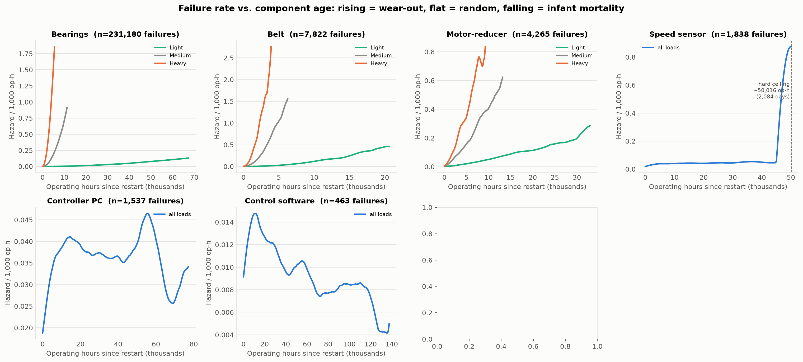
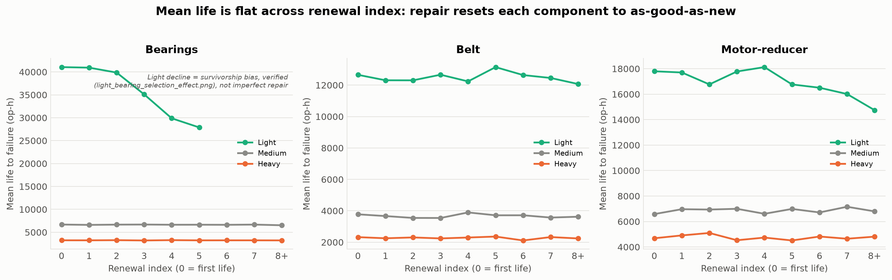
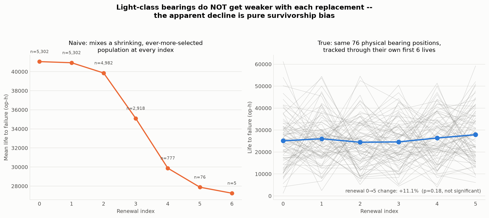
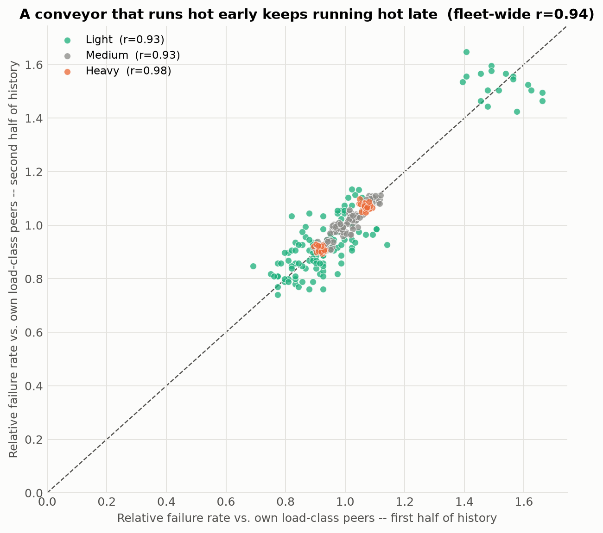
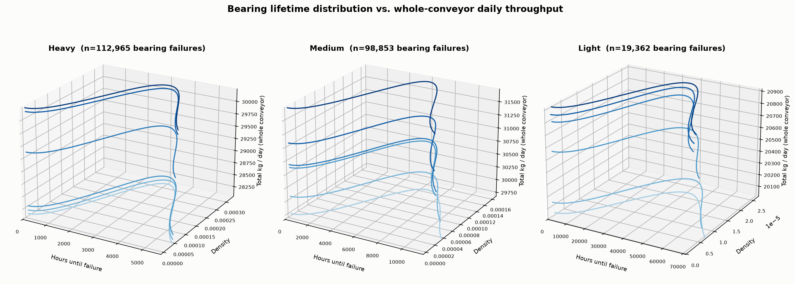
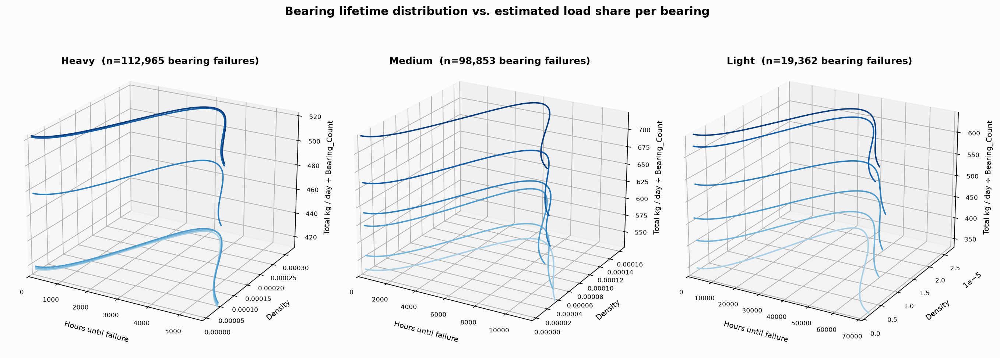
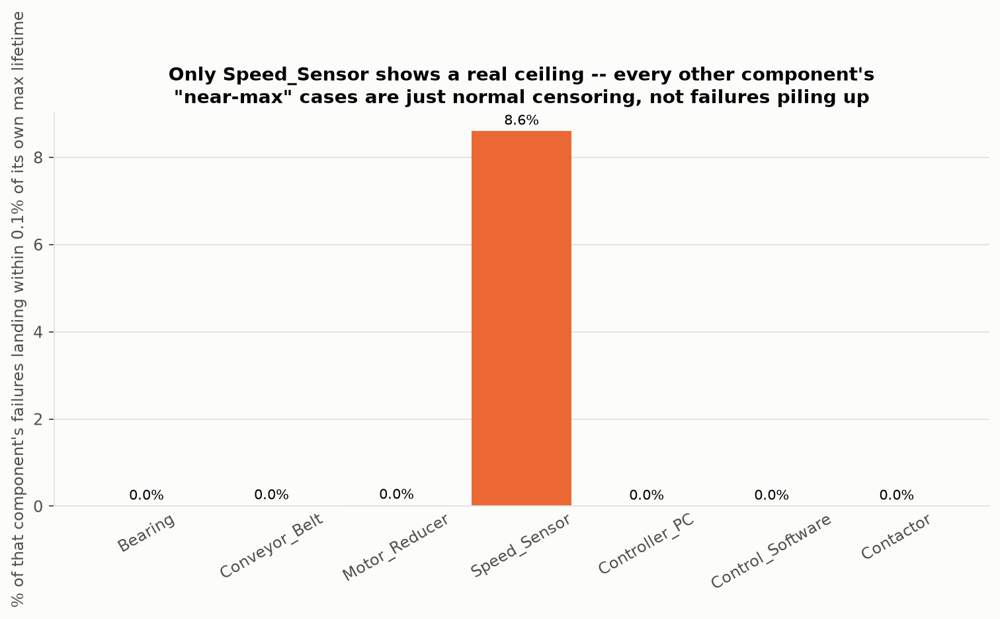
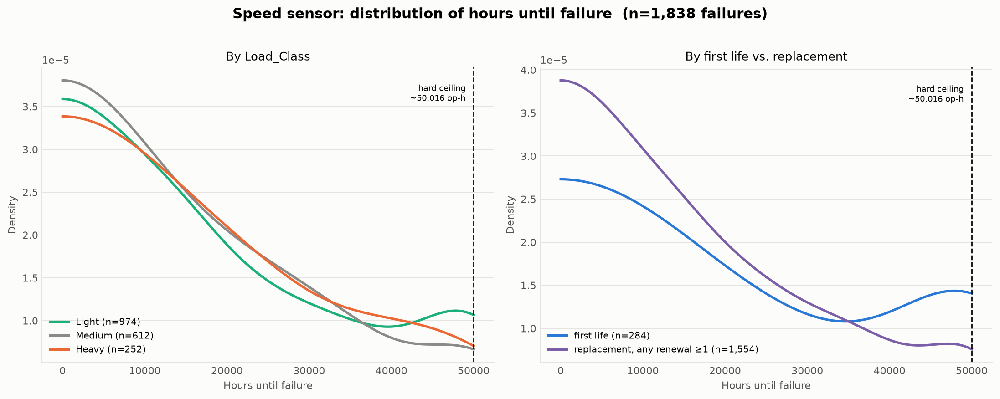

# Reliability Over Time — Presentation Candidates

**Source:** `outputs/req1/{intervals_*.parquet, frailty_check.csv}` — already computed
by `scripts/02_reliability_analysis.py`; no fleet-file re-query needed.
**Generated:** 2026-09-26.
**Reproduce:**
```
uv run --no-project --with duckdb --with matplotlib --with pandas --with numpy --with lifelines --with pyarrow \
  python analysis/reliability_over_time/plot_hazard_vs_age.py
uv run --no-project --with matplotlib --with pandas --with numpy --with pyarrow \
  python analysis/reliability_over_time/plot_renewal_check.py
uv run --no-project --with matplotlib --with pandas --with numpy \
  python analysis/reliability_over_time/plot_frailty_persistence.py
uv run --no-project --with duckdb --with matplotlib --with pandas --with numpy --with scipy --with pyarrow \
  python analysis/reliability_over_time/plot_light_bearing_selection_effect.py
uv run --no-project --with duckdb --with matplotlib --with pandas --with numpy --with scipy --with pyarrow \
  python analysis/reliability_over_time/plot_bearing_lifetime_vs_load_3d.py
uv run --no-project --with matplotlib --with pandas --with numpy --with pyarrow \
  python analysis/reliability_over_time/plot_data_audit_ceiling_check.py
uv run --no-project --with matplotlib --with pandas --with numpy --with scipy --with pyarrow \
  python analysis/reliability_over_time/plot_other_component_bell_curves.py
```

These are **candidate visualizations of already-established findings**, built for
review before deciding what goes on the 2 Req. 1 slides. They reuse the validated
palette from `scripts/07_figures.py` (`BLUE/ORANGE/AQUA`, `style()` conventions) for
visual consistency with `outputs/figures/{beta,load,cm}.png`, but nothing here has
been wired into `scripts/08_make_slides.py` — that's a separate, deliberate step.

## 1. Failure rate vs. component age — `hazard_vs_age.png`



The concrete counterpart to `beta.png`'s abstract Weibull shape (β) plot: an actual
smoothed hazard-rate curve (Nelson–Aalen estimator) vs. operating hours since restart,
per component.

- **Bearings, Belt, and Motor-Reducer** all show the expected wear-out shape — hazard
  rises with age, faster and higher for Heavy than Light — visually confirming β > 1
  and the load-stress-multiplier effect in one picture (this is `beta.png` and
  `load.png`'s two messages combined into one curve family). Each curve plateaus at
  high age rather than continuing to rise indefinitely, consistent with mixing
  first-life and renewed intervals at a component-specific steady state.
- **Speed sensor, Controller PC, Control Software** are much flatter overall (β close
  to 1), matching the "near-random"/"random" classification.
- **Unexpected, real finding: Speed_Sensor has a hard ceiling around 50,016 operating
  hours (≈2,084 days of continuous operation).** 158 of 2,122 speed-sensor renewal
  intervals land within 0.1% of that exact value — across all three load classes and
  every renewal index (checked directly against the raw interval data; no other
  component shows this pattern — every other component has only its single longest
  censored interval near its max). This looks like an engineered maximum design life
  baked into the data, not a statistical artifact, and it's a real nuance the
  "near-random, β≈1.19" Weibull summary misses entirely: the sensor behaves randomly
  *up to* a hard cutoff, then fails almost deterministically. This is a good,
  surprising, defensible headline candidate in its own right.

## 2. Renewal check — `renewal_check.png`



Visual for slide 1's existing "every component renews perfectly" bullet, which
currently has no figure. Mean life to failure by renewal index (0 = first life),
per load class.

- Medium and Heavy lines are flat across all 9 renewal-index buckets for all 3
  components — clean, direct visual confirmation of perfect renewal.
- **Light-class Bearings show a visible decline** (≈41,000 op-h at renewal 0 down to
  ≈28,000 op-h by renewal 5) that could be mis-read as contradicting the renewal
  claim. It's verified survivorship bias, not imperfect repair — see the dedicated
  investigation in §4 below, which nearly got fooled by the same bias a second time
  before landing on the real answer.

## 3. Does a Light-class bearing really get weaker each time it's replaced? — `light_bearing_selection_effect.png`, `plot_light_bearing_selection_effect.py`



This started as a follow-up question on §2's Light-bearing decline and turned into a
two-round investigation, both rounds worth recording because the first "proof" was
itself still wrong.

- **Round 1 (insufficient):** grouped `intervals_Bearing.parquet` by `Conveyor_ID` and
  compared, for the 48 Light conveyors that reach renewal index 5, their own mean life
  at index 0 vs. index 5. Result: a real, significant −31% decline (paired t-test,
  p<0.0001) — this looked like proof of genuine imperfect repair, contradicting the
  selection-effect explanation.
- **The catch:** `intervals_Bearing.parquet` only keeps `Conveyor_ID`, not the specific
  bearing position (`Failed_Component_ID`) — each Light conveyor has ~40 bearing
  positions, and "index 0" for a conveyor averages over *all* of them while "index 5"
  only reflects whichever 1–2 positions happen to already be on their 6th unit. That's
  the same survivorship bias one level down: comparing a typical bearing's first life
  to a chronically-short-lived position's later life, not the same physical unit
  before/after.
- **Round 2 (decisive):** rebuilt true per-position renewal sequences directly from the
  fleet file, keeping `Failed_Component_ID` (5,302 distinct Light-class bearing
  positions). Only 76 of those 5,302 (1.4%) ever reach renewal index 5 within 20 years
  — confirming the selection is severe. Tracking those exact 76 physical positions
  through their own renewal-0 and renewal-5 lives: **25,095 op-h → 27,885 op-h, +11%,
  p=0.18 (not significant).** No decline. If anything, the point estimate goes the
  other way.
- **Conclusion: Light-class bearings do not get weaker with repeated replacement.**
  The aggregate decline in §2/renewal_check.png is 100% an artifact of which bearing
  positions survive long enough to be counted at each renewal index, not a property of
  the repair process. Medium/Heavy don't show this pattern because, unlike Light,
  effectively all of their bearing positions reach a high renewal index within 20
  years, so there's no equivalent selection window.
- **Methodological note for anyone reusing this repo's renewal-interval data:** any
  question that needs the *same physical unit*, especially for Bearings, must be
  answered from `Failed_Component_ID`-level data, not `intervals_Bearing.parquet` as
  currently saved (Conveyor_ID only). This came up only because this specific question
  needed it; the existing Req. 1 Weibull/renewal analysis doesn't, since it pools
  intervals rather than pairing them.

## 4. Frailty persistence — `frailty_persistence.png`



Scatter of each conveyor's failure rate relative to its own load-class peers, first
half of its history vs. second half (from `frailty_check.csv`, no recomputation).
Fleet-wide r = 0.94 (Heavy 0.98, Light 0.93, Medium 0.93) — a conveyor that runs hot
relative to its peers early keeps running hot late. This is the single clearest visual
for the spec's explicit "uncertainty" ask: individual variation here is a real,
persistent, structured trait, not noise.

- **Bonus finding, not previously flagged:** the ~18 points sitting off on their own at
  the top right (relative rate ≈1.4–1.7 in *both* halves) are not scattered outliers —
  **all 18 belong to a single plant, P06.** One specific Light-class plant runs
  persistently ~50% hotter than the rest of the Light tier, fleet-wide, in every era of
  its history. Load_Class alone doesn't explain this; it's a plant-specific effect
  (environment, maintenance practice, or something else not in the modeled columns)
  worth a one-line mention if there's room, since it's concrete and immediately
  checkable by the organizers.

## 5. Bearing lifetime vs. daily throughput, in 3D — `bearing_lifetime_vs_kgday_raw_3d.png`, `bearing_lifetime_vs_kgday_per_bearing_3d.png`




Follow-up to §3: does daily throughput matter *within* a load class, not just between
them? For each Load_Class (3 panels per figure), bins conveyors into 6 throughput
slices and plots a Gaussian KDE ("bell curve") of bearing lifetime (hours until
failure) at each slice: X = hours until failure, Y = density, Z = daily throughput.
Uses the same true per-bearing-position data as §3 (13,938 distinct positions,
245,118 intervals, whole fleet), so `Bearing_Count` is handled by construction —
every physical bearing contributes one lifetime regardless of how many bearings share
its conveyor. Two Z-axis definitions, both produced since they answer slightly
different questions:
  - `..._raw_3d.png`: `Total_kg_Day`, the whole conveyor's daily throughput.
  - `..._per_bearing_3d.png`: `Total_kg_Day / Bearing_Count`, an estimated load share
    per bearing (a conveyor with more bearings spreads the same total load across more
    support points).

**Correction (see the dedicated writeup, [`bearing_lifetime_vs_throughput_findings.md`](bearing_lifetime_vs_throughput_findings.md), for the full numbers):**
a first read of these plots looked like higher throughput visibly shifts the bell
curve left *within* every load class — a within-class dose-response beyond the
already-known between-class effect (Heavy/Light η ratio in `weibull_by_clock.csv`).
Checking that against the underlying CSV does not support it: Spearman correlation
between bearing life and throughput is weak (|ρ| ≤ 0.13) and **inconsistent in
direction** (Heavy goes the *wrong* way — more throughput, slightly *longer* life;
Light flips sign between the raw and per-bearing Z-axis definitions). Throughput also
barely varies within a load class to begin with (5–8% range), so there isn't much of
a "dial" to detect a within-class effect from even if one existed. **Don't cite a
within-class throughput dose-response from these figures.** What does hold up: the
bell shape itself confirms wear-out behavior, and the large between-class differences
are real (§2 of the dedicated writeup). The raw and per-bearing Z-axis versions do
look similar, but that's because `Bearing_Count` itself barely varies within a load
class (58–68 for Heavy, 44–56 Medium, 32–62 Light) — not evidence of anything about
load-sharing.

## 6. Data audit: is the Speed_Sensor ceiling the only hidden artifact? — [`data_audit_ceiling_check.png`](data_audit_ceiling_check.png), [`data_audit_ceiling_check.csv`](data_audit_ceiling_check.csv)



Prompted by "the professor said there's a catch somewhere, hidden in the dataset."
Two checks, both against the raw fleet Parquet (not a cached intermediate), to see
whether the Speed_Sensor ceiling (§1) is one of several hidden artifacts or the only
one:

- **Every numeric column swept for the same clipping signature.** All 17 continuous
  columns (CM signals, environment, exposure, cumulative counters) checked for
  suspicious clustering at their min/max. Every one shows exactly the behavior normal
  operation predicts (`RUNNING` days pinned at 24 operating hours, non-running days at
  0, smooth natural tails elsewhere) — no other column shows anything like Speed_Sensor's
  pattern.
- **Whether corrective-repair downtime secretly varies by component** — CLAUDE.md
  flags this as an assumption ("every failure = exactly 1 corrective day / 36h total")
  that was never actually verified, only assumed. A first attempt at checking it found
  what looked like a real violation (multi-day corrective streaks for Bearing) — that
  turned out to be a bug in the query (a later failure's corrective days landing inside
  the same lookahead window as an earlier one, since Heavy-conveyor bearing failures
  cluster closely). A proper gaps-and-islands query, run directly against the fleet
  file, confirms the assumption is exactly correct: every one of 247,117 failures,
  every component, is followed by precisely 1 `CORRECTIVE_DOWNTIME` day. Not the catch.
- **[`data_audit_ceiling_check.csv`](data_audit_ceiling_check.csv)** formalizes the
  ceiling check from §1 across all 7 components using
  `outputs/req1/intervals_<component>.parquet`: the % of a component's own failures
  landing within 0.1% of that component's own max recorded lifetime. Speed_Sensor:
  **8.6%**. Every other component: ≤0.02%, and those handful of "near-max" cases are
  confirmed censored (still-running) units, not failures — i.e. just the normal fact
  that some conveyor always has the longest observed history, not a ceiling.

**Conclusion: the Speed_Sensor design-life ceiling (~50,016 op-h) is the one
deliberate hidden artifact in the dataset**, not one of several. It matters beyond
curiosity because it's invisible in the summary statistic everyone would naturally
report (β≈1.19, "near-random") — only ~9% of failures are affected, hidden inside an
otherwise-correct-looking random-failure characterization. Checked against the example
conveyor `P02CV27`: none of its 7 observed Speed_Sensor lifetimes hit the ceiling
(unsurprising — with a 91.4% chance of missing it per lifetime, ~55% chance of missing
it in all 7), so this isn't visible from the example files alone. **The hidden
evaluation conveyor could plausibly be one of the ~9% approaching it, which a
Weibull-only model would get badly wrong.**

## 7. Does bearing position (which physical slot) matter? — reuses [`bearing_position_intervals_all_loads.csv`](bearing_position_intervals_all_loads.csv)

Follow-up to §5, checking the other half of "does bearing count/position matter":
extracted each bearing's position number from `Failed_Component_ID` (e.g. `BRG_015`)
and its position as a fraction of that conveyor's `Bearing_Count` (0 = first slot,
1 = last slot), then checked Spearman correlation against lifetime, per load class.

**Result: no effect. ρ ≈ 0.0003 to −0.028 across all three load classes** — physical
position along the conveyor does not predict bearing lifetime. Learned from the §5
throughput mistake: checked this properly before writing it up, rather than building a
plot first. A bearing's slot is not a "weak point" — bearings are interchangeable
regardless of where they sit. No figure needed; the correlation table is the finding.

## 8. Bell curves for the other 5 failure types — [`bell_curve_*.png`](.)



Same treatment as §5/§7 extended to Conveyor_Belt, Motor_Reducer, Speed_Sensor,
Controller_PC, and Control_Software (Contactor skipped — 12 fleet-wide failures, too
sparse for a density estimate). Each gets two panels: by `Load_Class`, and by first
life (renewal 0) vs. any replacement (renewal ≥1). Reuses
`outputs/req1/intervals_<component>.parquet` directly, no fleet re-query.

**Methodological note, important for anyone reusing `plot_other_component_bell_curves.py`
or `plot_bearing_lifetime_vs_load_3d.py`:** a plain Gaussian KDE is biased near a hard
boundary at zero — it smooths probability mass to negative values that then just
vanish, which for a near-random or infant-mortality component (true density highest
*at* zero) fakes a peak away from zero that isn't really there. Caught this on
Controller_PC (β≈0.99, should have maximum density at hours=0): the first KDE attempt
showed a false peak around 8,000 hours; the raw histogram (rate 0.079/hour in the
first 1,000 hours, declining monotonically after) confirmed the peak was fake. Fixed
with a standard reflection correction (mirror the data across zero, double the
resulting density on the positive side) in both this script and
`plot_bearing_lifetime_vs_load_3d.py` (no visible effect there — Bearing is strongly
wear-out, so true density near zero really is ~0 — but applied for consistency).

- **Speed_Sensor's bell curve is visibly bimodal** once correctly shaped: a normal
  random-failure hump early, declining, then a second real bump right at the §1/§6
  ceiling — both mechanisms visible in one picture.
- **Control_Software** clearly shows its infant-mortality shape (β=0.91): Light-class
  failures peak early (~10,000 op-h) and decay; Heavy has only 6 failures fleet-wide,
  too few to show a real shape (flat near-zero line — a sample-size limitation, not a
  finding).
- **Controller_PC and Speed_Sensor (pre-ceiling) both show near-load-independent
  curves** (all three `Load_Class` lines overlap), consistent with their β≈1 fits —
  load doesn't shift these the way it does Bearing/Belt/Motor-Reducer.

## Recommendation for slide placement

- **Hazard-vs-age (§1)** is the strongest new candidate — it reads faster than
  `beta.png` for an oral audience and the Speed_Sensor ceiling is a genuinely new,
  surprising fact. Consider it as a replacement or companion for `beta.png`. (Note:
  `accuracy.png` now exists — a teammate built it separately for the Req 2/3 CV story;
  it's a different slide slot, not a candidate for these Req 1 figures.)
- **Renewal check (§2)** is a good companion figure specifically because the "every
  component renews perfectly" bullet currently has no visual backing it up — lowest
  risk, most direct slot-in.
- **Frailty persistence (§4)** is the best fit for an "uncertainty" bullet/claim if one
  is added; the P06 finding could be a strong closing line for the oral presentation
  even without its own figure.
- **The Speed_Sensor ceiling (§1/§6/§8)** is the single strongest "we found something
  the naive analysis would miss" story in this whole set — worth the oral presentation
  time even if the figure itself doesn't make the 2 slides.
