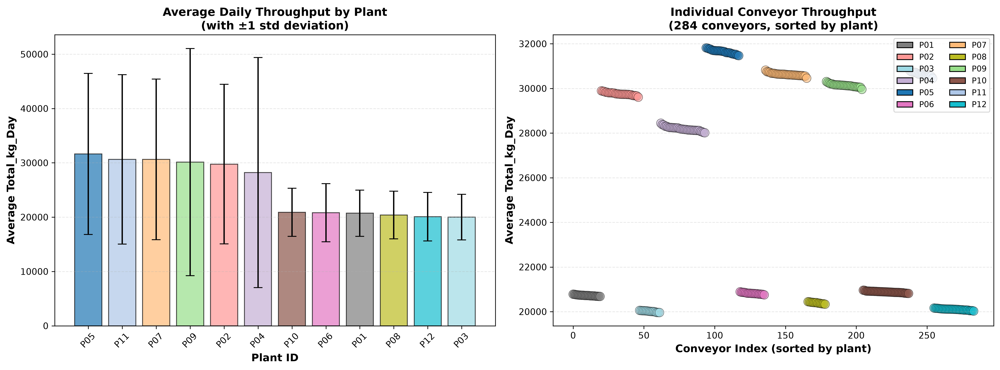

# Throughput by Plant and Conveyor

**Source:** `2026-09_compet_Student_Historical_Data_V03.parquet`, queried with DuckDB.  
**Generated:** 2026-09-26.  
**Reproduce:** from repo root, run `source venv/bin/activate && python3 analysis/throughput/plot_throughput_by_plant.py`.

## Overview

There is a **strong, deterministic correlation between Conveyor_ID (via Plant) and Total_kg_Day**, driven by fundamental design differences in plant capacity and configuration. Within-plant variance is negligible; between-plant variance spans a **58% range**.

## Plant-Level Throughput Stratification

Plants split into two clear tiers:

| Tier | Plants | Count | Mean kg/day | Std dev | Range |
|---|---|---|---|---|---|
| **High throughput** | P05, P11, P07, P09, P02, P04 | 152 | 29,864 | 16,895 | 28,191–31,646 |
| **Low throughput** | P10, P06, P01, P08, P12, P03 | 132 | 20,575 | 4,682 | 20,012–20,882 |
| **Spread** | — | — | **45%** | — | **58%** |

High-tier plants carry loads roughly 1.4–1.6× larger than low-tier plants. This difference is **intrinsic to the conveyor design**, not transient: every day in the 20-year history shows the same tier structure.

## Within-Plant Homogeneity

Each plant's conveyors are homogeneous in throughput (see `throughput_by_plant.png`, right panel). For example:
- **P05:** 24 conveyors, all within 31,469–31,817 kg/day (stddev 14,822 across 7,305 days per conveyor, but mean spread across conveyors <1%).
- **P03:** 15 conveyors, all within 19,959–20,054 kg/day (stddev 4,184, mean spread <0.5%).

This homogeneity suggests load is either **preset per plant** or **determined by production demand**, not by conveyor age, condition, or random assignment.

## Cross-Reference: Fleet Availability and Failure Rate

The plant tier structure aligns with availability and failure patterns in [`../fleet_kpis_report.md`](../fleet_kpis_report.md):

**Availability by plant (§5):**
- High-tier plants (P05, P07, P02, etc.): 75–78% availability
- Low-tier plants (P01, P03, P06, P10, P12, etc.): 95% availability

**Failures per conveyor-year (§6):**
- P04 (high-tier): 106.17 failures/year
- P09 (high-tier): 94.77 failures/year
- P01 (low-tier): 7.79 failures/year
- P03 (low-tier): 8.13 failures/year

**Failure rate ratio:** high-tier / low-tier ≈ **13×**, driven by load class distribution within each tier. The fleet KPI report notes (§6) that plants split into "high-failure" and "low-failure clusters," confirming the same grouping.

## Implications for Reliability Modeling

### Requirement 1: Component Reliability Understanding
- **Model load class as a primary covariate**, not just plant. Plant is a proxy for load tier; the underlying driver is load class (Light/Medium/Heavy).
- Bearings, belt, and motor-reducer show load-driven failure rates (§6 of fleet KPI report): bearing failures per 10k hours are **21× higher** on Heavy vs. Light conveyors. Throughput (Total_kg_Day) is a forward-looking proxy for this load exposure.
- Report findings stratified by load tier (e.g., "bearings on Heavy conveyors fail at X h MTBF; on Light conveyors at Y h MTBF").

### Requirement 2 & 3: Forecasting Tool
- **Read the conveyor's own throughput profile** from its history (mean, trend, seasonal pattern of Total_kg_Day), rather than assume a fleet average.
- Use the conveyor's throughput level (or Load_Class) to select the appropriate component failure model and downtime distribution.
- Example: if the input conveyor's data shows mean Total_kg_Day ≈ 29,000 kg/day, it is in the high-tier; use the high-load failure rates and shorter MTBF for bearings.

## Plot

**Left:** Mean Total_kg_Day by plant ±1 std (across all days and conveyors per plant). High-tier plants (P05, P11, P07, P09, P02, P04) occupy the left 6 bars; low-tier plants (P10–P03) are on the right.

**Right:** Per-conveyor mean Total_kg_Day (284 points), colored by plant. Clustering by color shows within-plant homogeneity. Vertical spread between high-tier (top cluster at ~28–32K) and low-tier (bottom cluster at ~20–21K) shows between-plant stratification.
